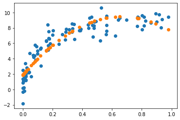
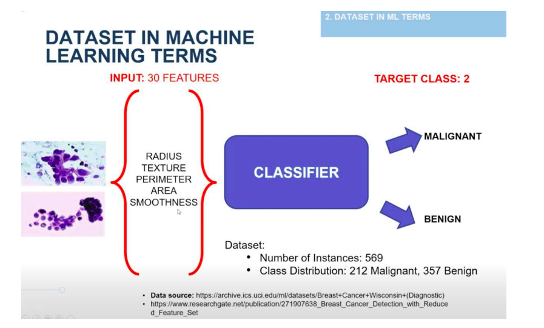
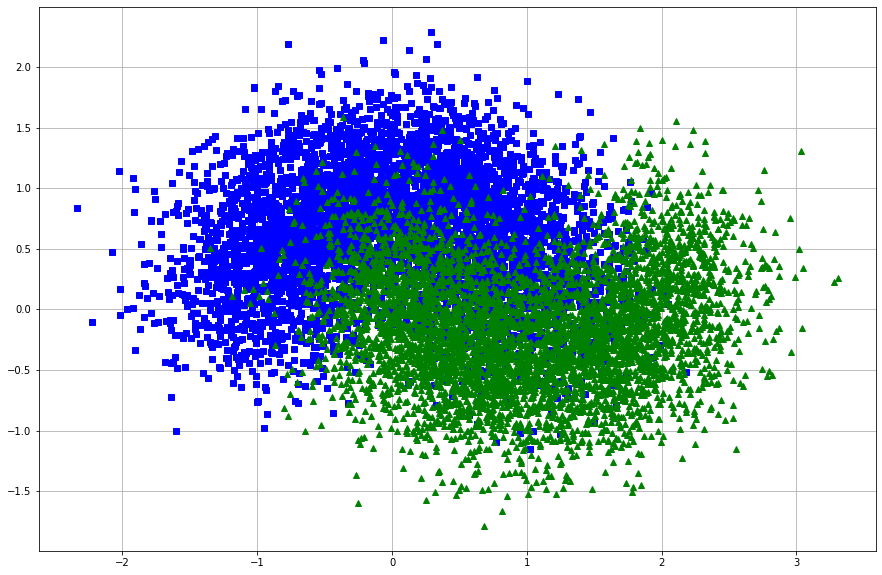
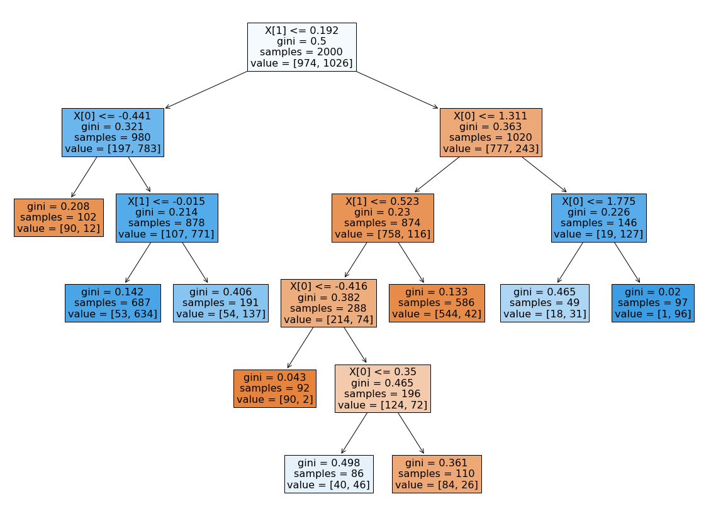
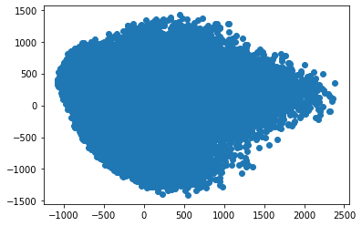

<hr>
<div>
    
</div>

<hr>          
<h1><center style="color:white; background-color : blue;">Table of contents</center></h1>

<div class="alert alert-block alert-info" style="margin-top: 20px">
    <ol>
        <li><a href="#1">Exercice 1 : K plus proches voisins - Test et validation de modeles
Illustrez la méthode</a></li>
        <li><a href="#2">Exercice 2 : SVM</a></li>
        <li><a href="#3">Exercice 3 : Arbre de decision</a></li>
        <li><a href="#4">Exercice 4 : Forêt aléatoire </a></li>
    </ol>
</div>
<br>
<hr>


<h1 ><center style = "background-color : blue; color :white">EXERCICE 1: K plus proches voisins</center></h1>
<hr>

`1. Testons et interpretons le segment de code qui suit`

* Importation des modules


```python
import numpy as np
import matplotlib.pyplot as plt
from sklearn.datasets import load_iris
from sklearn.linear_model import LinearRegression
```

* Lecture des données


```python
iris = load_iris ()
X = iris.data
Y = iris.target
```

* Exploration - Visualisation


```python
print ("Composition du Dataset :\n {0}".format(iris.keys()))
```

    Composition du Dataset :
     dict_keys(['data', 'target', 'target_names', 'DESCR', 'feature_names', 'filename'])


```python
print(iris["DESCR"])
```

    .. _iris_dataset:
    
    Iris plants dataset
    --------------------
    
    **Data Set Characteristics:**
    
        :Number of Instances: 150 (50 in each of three classes)
        :Number of Attributes: 4 numeric, predictive attributes and the class
        :Attribute Information:
            - sepal length in cm
            - sepal width in cm
            - petal length in cm
            - petal width in cm
            - class:
                    - Iris-Setosa
                    - Iris-Versicolour
                    - Iris-Virginica
                    
        :Summary Statistics:
    
        ============== ==== ==== ======= ===== ====================
                        Min  Max   Mean    SD   Class Correlation
        ============== ==== ==== ======= ===== ====================
        sepal length:   4.3  7.9   5.84   0.83    0.7826
        sepal width:    2.0  4.4   3.05   0.43   -0.4194
        petal length:   1.0  6.9   3.76   1.76    0.9490  (high!)
        petal width:    0.1  2.5   1.20   0.76    0.9565  (high!)
        ============== ==== ==== ======= ===== ====================
    
        :Missing Attribute Values: None
        :Class Distribution: 33.3% for each of 3 classes.
        :Creator: R.A. Fisher
        :Donor: Michael Marshall (MARSHALL%PLU@io.arc.nasa.gov)
        :Date: July, 1988
    
    The famous Iris database, first used by Sir R.A. Fisher. The dataset is taken
    from Fisher's paper. Note that it's the same as in R, but not as in the UCI
    Machine Learning Repository, which has two wrong data points.
    
    This is perhaps the best known database to be found in the
    pattern recognition literature.  Fisher's paper is a classic in the field and
    is referenced frequently to this day.  (See Duda & Hart, for example.)  The
    data set contains 3 classes of 50 instances each, where each class refers to a
    type of iris plant.  One class is linearly separable from the other 2; the
    latter are NOT linearly separable from each other.
    
    .. topic:: References
    
       - Fisher, R.A. "The use of multiple measurements in taxonomic problems"
         Annual Eugenics, 7, Part II, 179-188 (1936); also in "Contributions to
         Mathematical Statistics" (John Wiley, NY, 1950).
       - Duda, R.O., & Hart, P.E. (1973) Pattern Classification and Scene Analysis.
         (Q327.D83) John Wiley & Sons.  ISBN 0-471-22361-1.  See page 218.
       - Dasarathy, B.V. (1980) "Nosing Around the Neighborhood: A New System
         Structure and Classification Rule for Recognition in Partially Exposed
         Environments".  IEEE Transactions on Pattern Analysis and Machine
         Intelligence, Vol. PAMI-2, No. 1, 67-71.
       - Gates, G.W. (1972) "The Reduced Nearest Neighbor Rule".  IEEE Transactions
         on Information Theory, May 1972, 431-433.
       - See also: 1988 MLC Proceedings, 54-64.  Cheeseman et al"s AUTOCLASS II
         conceptual clustering system finds 3 classes in the data.
       - Many, many more ...


```python
print ("Les types de fleurs du dataset Iris sont :\n {0}".format(iris["target_names"]))
```

    Les types de fleurs du dataset Iris sont :
     ['setosa' 'versicolor' 'virginica']


```python
X[:5]
```


    array([[5.1, 3.5, 1.4, 0.2],
           [4.9, 3. , 1.4, 0.2],
           [4.7, 3.2, 1.3, 0.2],
           [4.6, 3.1, 1.5, 0.2],
           [5. , 3.6, 1.4, 0.2]])


```python
Y
```


    array([0, 0, 0, 0, 0, 0, 0, 0, 0, 0, 0, 0, 0, 0, 0, 0, 0, 0, 0, 0, 0, 0,
           0, 0, 0, 0, 0, 0, 0, 0, 0, 0, 0, 0, 0, 0, 0, 0, 0, 0, 0, 0, 0, 0,
           0, 0, 0, 0, 0, 0, 1, 1, 1, 1, 1, 1, 1, 1, 1, 1, 1, 1, 1, 1, 1, 1,
           1, 1, 1, 1, 1, 1, 1, 1, 1, 1, 1, 1, 1, 1, 1, 1, 1, 1, 1, 1, 1, 1,
           1, 1, 1, 1, 1, 1, 1, 1, 1, 1, 1, 1, 2, 2, 2, 2, 2, 2, 2, 2, 2, 2,
           2, 2, 2, 2, 2, 2, 2, 2, 2, 2, 2, 2, 2, 2, 2, 2, 2, 2, 2, 2, 2, 2,
           2, 2, 2, 2, 2, 2, 2, 2, 2, 2, 2, 2, 2, 2, 2, 2, 2, 2])


* Interprétation

<hr>
Les modules ci-dessous vont nous permettre de charger, entrainer et tester des modèles de machine learning sur le jeu de données  iris qui comporte la longueur et la largeur des sépales et des pétales de 150 fleurs d’iris de trois espèces différentes : Iris sesotat, Iris versicolor et Iris viginica.
<hr>

`2. Créons le classifieur à l’aide du module KNeighborsClassifier`


```python
from sklearn.neighbors import KNeighborsClassifier
model = KNeighborsClassifier ( n_neighbors = 1 )
```

Au niveau du script ci dessous on a instancié un KNN avec comme hyperparametre k =1

`3. Entraînons le modèle et en déduisons en  le nombre de points correctement étiqueté.`

* Entrainement du modéle


```python
model.fit(X, Y)
Y_model = model.predict(X)
```

* Nombre de points correctement étiquetés


```python
from sklearn.metrics import accuracy_score
print("ACCURACY SCORE : {0} ".format(accuracy_score (Y, Y_model)))
```

    ACCURACY SCORE : 1.0 


On a un score de 100% ce qui prouve que tous les points on été correctement étiquetés.

`4. Validons le modèle à l’aide des données test et interpréter les résultats obtenus.`

* Importation du module train_test_split de Scikit-Learn


```python
from sklearn.model_selection import train_test_split
```

* Subdivision des données en deux parties égales


```python
X1 , X2 , Y1 , Y2 = train_test_split (X, Y, random_state =0 ,train_size =0.5)
```

* utilisation  d'une partie des données pour entraîner le modèle


```python
model.fit(X1 , Y1)
```


    KNeighborsClassifier(algorithm='auto', leaf_size=30, metric='minkowski',
                         metric_params=None, n_jobs=None, n_neighbors=1, p=2,
                         weights='uniform')


* Evaluons le modèle sur la seconde partie des données


```python
Y2_model = model.predict(X2)
```

* Taux d’exactitude


```python
print("ACCURACY SCORE : {0} ".format(accuracy_score (Y2, Y2_model)))
```

    ACCURACY SCORE : 0.9066666666666666 


`5. Validons le modèle à l’aide de la validation croisée.`

* Deux patchs


```python
Y1_model = model.fit(X2 , Y2).predict(X1)
Y2_model = model.fit(X1 , Y1).predict(X2)

ac_1 = accuracy_score(Y1 , Y1_model)
ac_2 = accuracy_score(Y2 , Y2_model)

print("\nAccuracy Score du Premier Patch (Y1_model) : {0}\n".format(ac_1))
print("Accuracy Score du Deuxieme Patch Patch (Y2_model) : {0}".format(ac_2))
```

    
    Accuracy Score du Premier Patch (Y1_model) : 0.96
    
    Accuracy Score du Deuxieme Patch Patch (Y2_model) : 0.9066666666666666


* Patchs avec le module cross_val_score


```python
from sklearn.model_selection import cross_val_score

cvs_1 = cross_val_score (model , X1, Y1_model, cv =5)
cvs_2 = cross_val_score (model , X2, Y2_model, cv =5)

print("\nCross_Val_Score du Premier Patch (Y1_model) : {0}\n".format(cvs_1))
print("Cross_Val_Score du Premier Patch (Y1_model) : {0}".format(cvs_2))
```

    
    Cross_Val_Score du Premier Patch (Y1_model) : [0.9375     1.         1.         0.93333333 0.92307692]
    
    Cross_Val_Score du Premier Patch (Y1_model) : [0.94117647 0.86666667 0.93333333 0.78571429 0.85714286]


* Avec la methode LeaveOneOut


```python
from sklearn.model_selection import LeaveOneOut

scores_1 = cross_val_score (model , X1, Y1_model, cv=LeaveOneOut())
scores_2 = cross_val_score (model , X2, Y2_model, cv=LeaveOneOut())

print("\nCross_Val_Score du Premier Patch (Y1_model) : {0}\n".format(scores_1))
print("Cross_Val_Score du Premier Patch (Y1_model) : {0}".format(scores_2))
```

    
    Cross_Val_Score du Premier Patch (Y1_model) : [1. 1. 1. 1. 0. 1. 1. 1. 1. 1. 1. 1. 1. 1. 1. 1. 1. 1. 1. 1. 1. 1. 1. 1.
     1. 1. 1. 1. 1. 1. 1. 1. 1. 1. 1. 1. 1. 1. 1. 1. 1. 1. 1. 1. 1. 1. 1. 1.
     1. 1. 1. 1. 1. 1. 1. 1. 1. 1. 0. 1. 1. 1. 1. 1. 1. 1. 1. 0. 1. 1. 1. 1.
     1. 1. 1.]
    
    Cross_Val_Score du Premier Patch (Y1_model) : [1. 1. 1. 1. 1. 1. 1. 1. 1. 1. 1. 1. 0. 1. 0. 1. 1. 1. 1. 1. 1. 1. 1. 1.
     0. 1. 1. 1. 1. 1. 1. 1. 1. 1. 1. 1. 1. 0. 1. 1. 1. 1. 1. 1. 1. 1. 1. 1.
     0. 1. 1. 1. 1. 1. 0. 0. 1. 1. 1. 1. 1. 1. 1. 1. 1. 1. 0. 1. 1. 1. 1. 1.
     1. 1. 1.]


`6. GridSearch`

`6.a Decrivons la méthode et comparons le aux méthodes précédentes.`

<hr>
La plupart des modèles de machine learning doivent être paramétrés pour donner les meilleurs résultats. Par exemple pour un KNeighborsClassifier, on doit choisir l'hyperparametre k. Si on paramètre à la main, cela peut vite s’avérer très coûteux en temps (et pas forcément très intéressant).

C’est là que le Grid search intervient. C’est une méthode d’optimisation (hyperparameter optimization) qui va nous permettre de tester une série de paramètres et de comparer les performances pour en déduire le meilleur paramétrage.

Il existe plusieurs manières de tester les paramètres d’un modèle et le Grid Search est une des méthodes les plus simples. Pour chaque paramètre, on détermine un ensemble de valeurs que l’on souhaite tester. 
Le Grid Search croise simplement chacune de ces hypothèses et va créer un modèle pour chaque combinaison de paramètres.
<hr>

`6.b Importons les modules et fixons les paramètres`

* Implémentation de la fonction


```python
from sklearn.preprocessing import PolynomialFeatures
from sklearn.linear_model import LinearRegression
from sklearn.pipeline import make_pipeline

def PolynomialRegression(**kwargs):
    return make_pipeline(PolynomialFeatures(), LinearRegression(**kwargs))
```


```python
from sklearn.model_selection import GridSearchCV

param_grid = { 'polynomialfeatures__degree': np. arange (21) , 
               'linearregression__fit_intercept': [True , False ] ,
               'linearregression__normalize': [True , False ],
             }

grid = GridSearchCV ( PolynomialRegression () , param_grid , cv =7, iid=True)
```

* Entrainement


```python
grid.fit(X1, Y1);
```


```python
grid.best_params_
```


    {'linearregression__fit_intercept': True,
     'linearregression__normalize': True,
     'polynomialfeatures__degree': 2}


```python
grid.best_estimator_
```


    Pipeline(memory=None,
             steps=[('polynomialfeatures',
                     PolynomialFeatures(degree=2, include_bias=True,
                                        interaction_only=False, order='C')),
                    ('linearregression',
                     LinearRegression(copy_X=True, fit_intercept=True, n_jobs=None,
                                      normalize=True))],
             verbose=False)


`6.c En nous inspirant du script qui suit cherchons le meilleur paramètre`


```python
import numpy as np

def make_data (N, err =1.0 , rseed =1):
    # randomly sample the data
    rng = np.random.RandomState(rseed)
    X = rng.rand (N, 1)** 2
    y = 10 - 1. / (X. ravel () + 0.1)
    if err > 0:
        y += err * rng . randn (N)
    return X, y
```


```python
X, y = make_data (100)
```


```python
X_train , X_test , y_train, y_test = train_test_split(X, y, random_state =0 ,train_size =0.5)
```


```python
model = grid.best_estimator_

plt.scatter (X , y)
lim = plt.axis()
Y_test = model.fit(X_train, y_train).predict( X_test )
plt.scatter( X_test , Y_test);
plt.axis ( lim );
```





`6.d Interprétons les résultats obtenus.`

<hr>
Pour connaitre les meilleurs paramètre du modèle on a utiliser la fonction GridSearch de Scikit-Learn pour tester plusieurs modèle de régression Polynomiale avec des degrés differents sur le jeu de données qu'on a généré.
D'apres les resultats obtenus, on peut interpréter que le meilleur modèle pour nos données est le modèle Polynomial de degré 2 avec une normalisation des données d'entrainement au préalable.

<hr>
<h1 ><center style = "background-color : blue; color :white">EXERCICE 2: SVM</center></h1>
<hr>

`1. Exploration - Traitements - Description des données`

* Description du Dataset


<hr>
Nous allons utiliser le jeu de données sur le cancer du sein de Scikit-Learn(Breast Cancer).Cet ensemble de données est calculé à partir d'une image numérisée d'un aspirat à l'aiguille fine (FNA) d'une masse mammaire. Ils décrivent les caractéristiques des noyaux cellulaires présents dans l'image.

Le dataset comprend 30 caractéristiques (rayon moyen, texture moyenne, périmètre moyen, aire moyenne, lissé moyen, compacité moyenne, concavité moyenne, points concaves moyens, symétrie moyenne, dimension fractale moyenne, erreur de rayon, erreur de texture, erreur de périmètre, erreur de surface, erreur de lissage, erreur de compacité, erreur de concavité, erreur de points concaves, erreur de symétrie, erreur de dimension fractale, pire rayon, pire texture, pire périmètre, pire zone, pire lissage, pire compacité, pire concavité, pires points concaves, pire symétrie et pire dimension fractale) et une cible (type de cancer).

Ces données ont deux types de classes de cancer: malin (nocif) et bénin (non nocif).

<hr>

* Chargement et Exploration du Dataset


```python
from sklearn import datasets

data_set = datasets.load_breast_cancer()
```


```python
data_set.keys()
```


    dict_keys(['data', 'target', 'target_names', 'DESCR', 'feature_names', 'filename'])


```python
data_set.target_names
```


    array(['malignant', 'benign'], dtype='<U9')


```python
data_set.feature_names
```


    array(['mean radius', 'mean texture', 'mean perimeter', 'mean area',
           'mean smoothness', 'mean compactness', 'mean concavity',
           'mean concave points', 'mean symmetry', 'mean fractal dimension',
           'radius error', 'texture error', 'perimeter error', 'area error',
           'smoothness error', 'compactness error', 'concavity error',
           'concave points error', 'symmetry error',
           'fractal dimension error', 'worst radius', 'worst texture',
           'worst perimeter', 'worst area', 'worst smoothness',
           'worst compactness', 'worst concavity', 'worst concave points',
           'worst symmetry', 'worst fractal dimension'], dtype='<U23')


```python
data_set.data
```


    array([[1.799e+01, 1.038e+01, 1.228e+02, ..., 2.654e-01, 4.601e-01,
            1.189e-01],
           [2.057e+01, 1.777e+01, 1.329e+02, ..., 1.860e-01, 2.750e-01,
            8.902e-02],
           [1.969e+01, 2.125e+01, 1.300e+02, ..., 2.430e-01, 3.613e-01,
            8.758e-02],
           ...,
           [1.660e+01, 2.808e+01, 1.083e+02, ..., 1.418e-01, 2.218e-01,
            7.820e-02],
           [2.060e+01, 2.933e+01, 1.401e+02, ..., 2.650e-01, 4.087e-01,
            1.240e-01],
           [7.760e+00, 2.454e+01, 4.792e+01, ..., 0.000e+00, 2.871e-01,
            7.039e-02]])


```python
data_set.data.shape
```


    (569, 30)


* Subdivision des données en deux parties (training set and test set)


```python
from sklearn.model_selection import train_test_split

X = data_set.data
Y = data_set.target
X_train , X_test , Y_train , Y_test = train_test_split (X, Y, random_state =0 ,train_size =0.2)
```


```python
Y_train
```


    array([1, 1, 1, 1, 1, 1, 1, 0, 0, 1, 1, 1, 0, 1, 1, 1, 1, 0, 1, 0, 0, 0,
           1, 0, 1, 0, 1, 0, 0, 1, 1, 1, 1, 1, 1, 1, 1, 0, 0, 0, 0, 0, 1, 1,
           1, 1, 1, 1, 1, 0, 1, 0, 1, 1, 1, 1, 1, 0, 0, 0, 1, 0, 1, 1, 0, 0,
           0, 0, 1, 0, 0, 0, 1, 0, 1, 0, 1, 1, 0, 0, 1, 0, 1, 1, 1, 1, 0, 1,
           1, 0, 1, 1, 1, 0, 0, 1, 1, 1, 0, 1, 1, 0, 1, 1, 1, 1, 1, 0, 0, 0,
           1, 1, 1])


`2. Entrainement d'un premier modèle de SVM `

<hr>

<hr>

* Normalisation des données


```python
from sklearn.preprocessing import StandardScaler

std_scaler = StandardScaler()
X_train_scaled = std_scaler.fit_transform(X_train)
X_test_scaled = std_scaler.transform(X_test)
```

* Entrainement du modèle


```python
from sklearn.svm import SVC

classifier = SVC()
classifier.fit(X_train_scaled, Y_train)
```


    SVC(C=1.0, cache_size=200, class_weight=None, coef0=0.0,
        decision_function_shape='ovr', degree=3, gamma='auto_deprecated',
        kernel='rbf', max_iter=-1, probability=False, random_state=None,
        shrinking=True, tol=0.001, verbose=False)


* `Evaluation du modèle `


```python
from sklearn.metrics import classification_report, confusion_matrix, precision_score, recall_score
from sklearn.model_selection import GridSearchCV

Y_predict_test = classifier.predict(X_test_scaled)
cm_test = confusion_matrix(Y_test, Y_predict_test)
```


```python
print("Matrice de Confudion du Premier Modèle :\n\n{0}".format(cm_test))
```

    Matrice de Confudion du Premier Modèle :
    
    [[154  15]
     [  4 283]]


```python
print(classification_report(Y_test, Y_predict_test))
```

                  precision    recall  f1-score   support
    
               0       0.97      0.91      0.94       169
               1       0.95      0.99      0.97       287
    
        accuracy                           0.96       456
       macro avg       0.96      0.95      0.95       456
    weighted avg       0.96      0.96      0.96       456
    


```python
print("Notre modèle a une prècision de  : {0}".format(precision_score ( Y_test , Y_predict_test )))
```

    Notre modèle a une prècision de  : 0.9496644295302014


* Analyse et Interprétation des statistiques

Notre premier modele se comporte pas mal avec les données d'entrainement avec une precison de 94.9%.

`3. Choix des paramètres pour un meilleur modèle`

* Utilisation de GreadSearch


```python
param_grid = {'C':[0.1, 1, 10, 100], 'gamma': [1, 0.1, 0.01, 0.001], 'kernel':['rbf']}
```


```python
grid = GridSearchCV(SVC(), param_grid, refit=True, iid='True', cv=10)
grid.fit(X_train_scaled, Y_train)
```


    GridSearchCV(cv=10, error_score='raise-deprecating',
                 estimator=SVC(C=1.0, cache_size=200, class_weight=None, coef0=0.0,
                               decision_function_shape='ovr', degree=3,
                               gamma='auto_deprecated', kernel='rbf', max_iter=-1,
                               probability=False, random_state=None, shrinking=True,
                               tol=0.001, verbose=False),
                 iid='True', n_jobs=None,
                 param_grid={'C': [0.1, 1, 10, 100], 'gamma': [1, 0.1, 0.01, 0.001],
                             'kernel': ['rbf']},
                 pre_dispatch='2*n_jobs', refit=True, return_train_score=False,
                 scoring=None, verbose=0)


* Les meilleurs paramétres du modèle


```python
grid.best_params_
```


    {'C': 100, 'gamma': 0.001, 'kernel': 'rbf'}


* Le meilleur modèle


```python
grid.best_estimator_
```


    SVC(C=100, cache_size=200, class_weight=None, coef0=0.0,
        decision_function_shape='ovr', degree=3, gamma=0.001, kernel='rbf',
        max_iter=-1, probability=False, random_state=None, shrinking=True,
        tol=0.001, verbose=False)


* `Evaluation du modèle sur le données de test`


```python
best_model = grid.best_estimator_
Y_pred_opt_test = best_model.predict(X_test_scaled)
cm_opt_test = confusion_matrix(Y_test, Y_pred_opt_test)
```


```python
print("Matrice de Confudion  :\n\n{0}".format(cm_opt_test))
```

    Matrice de Confudion  :
    
    [[156  13]
     [  6 281]]


```python
print(classification_report(Y_test, Y_pred_opt_test))
```

                  precision    recall  f1-score   support
    
               0       0.96      0.92      0.94       169
               1       0.96      0.98      0.97       287
    
        accuracy                           0.96       456
       macro avg       0.96      0.95      0.95       456
    weighted avg       0.96      0.96      0.96       456
    


```python
print("Notre modèle a une prècision de  : {0}".format(precision_score ( Y_test , Y_pred_opt_test )))
```

    Notre modèle a une prècision de  : 0.95578231292517


`4. Conclusion`

Apres la recherche du meilleur modèle pour nos données, on a pu avoir un modèle avec une meilleure précision  que la première.

<hr>
<h1 ><center style = "background-color : blue; color :white">EXERCICE 3  :  ARBRE DE DECISION</center></h1>
<hr>

Entraînons et réglons précisément un arbre de décision pour le jeu de données
moons.

`1. Avec make_moons(n_samples = 10000, noise = 0.4)`

`1.a Générons un jeu de données moons`


```python
from sklearn import datasets

moons_data = datasets.make_moons(n_samples=10000, noise=0.4)
```

`1.b Décrivons et interprétons les données.`

* Extraction de X et Y


```python
moons_data[0]
```


    array([[-1.31446629,  0.57249592],
           [ 0.06423028,  0.79819377],
           [ 0.42368805, -0.22000708],
           ...,
           [ 0.13623611,  0.65077569],
           [-0.2234556 , -0.64888612],
           [-0.30339579,  1.06539782]])


```python
X = moons_data[0]
Y = moons_data[1]
```

* Visualisation


```python
import matplotlib.pyplot as plt
plt.figure(figsize=((15, 10)))
plt.plot(X[:, 0][Y==0], X[:, 1][Y==0], "bs")
plt.plot(X[:, 0][Y==1], X[:, 1][Y==1], "g^")
plt.grid()
plt.show()
```





* Interpretation des données

<hr>
D'aprés la visualisation ci-dessous, on constate que notre dataset est composé de deux classes prépondérantes reparties de façon uniforme.
Ainsi par la suite, nous essayerons d'entrainer un modele de mahcine Learning qui va nous permettre de séparer ces deux classes avec un score raisonnable.
<hr>

`2. Partagons-le entre un jeu d’entraînement et un jeu de test à l’aide de train_test_split().`


```python
from sklearn.model_selection import train_test_split

X_train , X_test, Y_train, Y_test = train_test_split (X, Y, random_state =0 ,train_size =0.2)
```

`3. Utilisons une recherche par quadrillage avec validation croisée (à l’aide de la classe GridSearchCV ) pour rechercher les bonnes valeurs d’hyperparamètres pour un Decision Tree Classifier. Interprétons les résultats obtenus`

* Implémentation


```python
from sklearn.model_selection import GridSearchCV
from sklearn.tree import DecisionTreeClassifier

params = {'max_leaf_nodes': list(range(2, 100)), 'min_samples_split': [2, 3, 4],
           'criterion' : ['gini', 'entropy'] }

grid_search_cv = GridSearchCV(DecisionTreeClassifier(random_state=42), params, n_jobs=-1, verbose=1, cv=3)

grid_search_cv.fit(X_train, Y_train)
```

    Fitting 3 folds for each of 588 candidates, totalling 1764 fits


    [Parallel(n_jobs=-1)]: Using backend LokyBackend with 4 concurrent workers.
    [Parallel(n_jobs=-1)]: Done 1436 tasks      | elapsed:    2.6s
    [Parallel(n_jobs=-1)]: Done 1764 out of 1764 | elapsed:    3.2s finished


    GridSearchCV(cv=3, error_score='raise-deprecating',
                 estimator=DecisionTreeClassifier(class_weight=None,
                                                  criterion='gini', max_depth=None,
                                                  max_features=None,
                                                  max_leaf_nodes=None,
                                                  min_impurity_decrease=0.0,
                                                  min_impurity_split=None,
                                                  min_samples_leaf=1,
                                                  min_samples_split=2,
                                                  min_weight_fraction_leaf=0.0,
                                                  presort=False, random_state=42,
                                                  splitter='best'),
                 iid='warn', n_jobs=-1,
                 param_grid={'criterion': ['gini', 'entropy'],
                             'max_leaf_nodes': [2, 3, 4, 5, 6, 7, 8, 9, 10, 11, 12,
                                                13, 14, 15, 16, 17, 18, 19, 20, 21,
                                                22, 23, 24, 25, 26, 27, 28, 29, 30,
                                                31, ...],
                             'min_samples_split': [2, 3, 4]},
                 pre_dispatch='2*n_jobs', refit=True, return_train_score=False,
                 scoring=None, verbose=1)


* Interpretation des resultats obtenues

<hr>
La classe GridSearchCV de scikit-Learn a été utilisé pour trouver les meilleurs paramètres pour notre modele de DecisionTreeClassifier.
En effet, les trois paramètres choisis sont : 

* Criterion : Fonction pour mesurer la qualité d'une scission. Les critères pris en charge sont «gini» pour l'impureté de Gini et «entropie» pour le gain d'information.

* min_samples_split : Le nombre minimum d'échantillons requis pour fractionner un nœud interne.

* max_leaf_nodes : Le nombre minimum d'échantillons requis pour être au niveau d'un nœud feuille. Un point de partage à n'importe quelle profondeur ne sera considéré que s'il laisse au moins min_samples_leafdes échantillons d'apprentissage dans chacune des branches gauche et droite. Cela peut avoir pour effet de lisser le modèle, notamment en régression.
<hr>


```python
print("Les meilleurs paramètres du modèle obtenues apres entrainement sont:\n {0}".format(grid_search_cv.best_params_))
```

    Les meilleurs paramètres du modèle obtenues apres entrainement sont:
     {'criterion': 'gini', 'max_leaf_nodes': 9, 'min_samples_split': 2}


`4.a Entraînons l’arbre de décision sur l’ensemble du jeu d’entraînement en utilisant ces hyperparamètres`

* Entrainement


```python
best_model = grid_search_cv.best_estimator_
best_model.fit(X_train, Y_train)
```


    DecisionTreeClassifier(class_weight=None, criterion='gini', max_depth=None,
                           max_features=None, max_leaf_nodes=9,
                           min_impurity_decrease=0.0, min_impurity_split=None,
                           min_samples_leaf=1, min_samples_split=2,
                           min_weight_fraction_leaf=0.0, presort=False,
                           random_state=42, splitter='best')


* Représentation Graphique de l'arbre


```python
from sklearn.tree import plot_tree
plt.figure(figsize=(20, 15))
plot_tree(best_model,filled=True)
plt.show()
```





`4.b Mesurons les performances de notre modèle sur le jeu de test`


```python
from sklearn.metrics import classification_report, confusion_matrix, precision_score, recall_score

Y_predict = best_model.predict(X_test)
cm = confusion_matrix(Y_test, Y_predict)
```


```python
print("Matrice de Confudion  :\n\n{0}".format(cm))
```

    Matrice de Confudion  :
    
    [[3259  767]
     [ 450 3524]]


```python
print(classification_report(Y_test, Y_predict))
```

                  precision    recall  f1-score   support
    
               0       0.88      0.81      0.84      4026
               1       0.82      0.89      0.85      3974
    
        accuracy                           0.85      8000
       macro avg       0.85      0.85      0.85      8000
    weighted avg       0.85      0.85      0.85      8000
    


```python
from sklearn.metrics import accuracy_score

print("Notre modèle a une prècision de  : {0}".format(precision_score ( Y_test , Y_predict )))
print("Accuracy Score Du Modele :{0} ".format(accuracy_score(Y_test, Y_predict)))
```

    Notre modèle a une prècision de  : 0.8212537869960382
    Accuracy Score Du Modele :0.847875 


`4.c Interprétons les résultats obtenus.`

D'aprés les mesures de performances obtenus ci-dessous, on peut dire que notre modèle est plus ou moins bon avec un score qui tourne autour des 85%.

<hr>
<h1 ><center style = "background-color : blue; color :white">EXERCICE 4  :  FORET ALEATOIRE</center></h1>
<hr>

Chargons le jeu de données MNIST

<hr>
D'abord, parlons du jeu de données que nous allons utiliser. C'est un dataset très célèbre, appelé MNIST. Il est constitué d'un ensemble de 70000 images 28x28 pixels en noir et blanc annotées du chiffre correspondant (entre 0 et 9). L'objectif de ce jeu de données était de permettre à un ordinateur d'apprendre à reconnaître des nombres manuscrits automatiquement (pour lire des chèques par exemple). Ce dataset utilise des données réelles qui ont déjà été pré-traitées pour être plus facilement utilisables par un algorithme.
<hr>

<hr>

`1. Reduction de dimension`

`1.a Partageons le jeu de données MNIST entre un jeu d’entraînementet un jeu de test (prenez les 60000 premières observations pour l’entraînement et les 10000 restantes pour le test).`

* Chargement des données


```python
from sklearn.datasets import fetch_openml
mnist_digits_data = fetch_openml('mnist_784', version=1)
```

* Partage des données


```python
X_train = mnist_digits_data["data"][10000: ,]
Y_train = ((mnist_digits_data["target"][10000:,]))
X_test = mnist_digits_data["data"][60000: ,]
Y_test = ((mnist_digits_data["target"][60000:,]))
```

`1.b Entraînons un classificateur de type forêt aléatoire sur le premier jeu et mesurez le temps de calcul, puis évaluons le modèle obtenu sur le jeu de données, en conservant 95% de la variance.`

* Entrainement Du Modele


```python
from sklearn.ensemble import RandomForestClassifier

rfc = RandomForestClassifier(n_estimators=2)
rfc.fit(X_train, Y_train)
```


    RandomForestClassifier(bootstrap=True, class_weight=None, criterion='gini',
                           max_depth=None, max_features='auto', max_leaf_nodes=None,
                           min_impurity_decrease=0.0, min_impurity_split=None,
                           min_samples_leaf=1, min_samples_split=2,
                           min_weight_fraction_leaf=0.0, n_estimators=2,
                           n_jobs=None, oob_score=False, random_state=None,
                           verbose=0, warm_start=False)


* Temps De Calcul


```python
from time import time

def countTime(X, Y, model):
    t0 = time()
    model.fit(X, Y)
    t1 = time()
    return t1 - t0
```


```python
print("Le Temps De Calcul : {0}".format(countTime(X_train, Y_train, rfc)))
```

    Le Temps De Calcul : 1.006021499633789


`1.c Entraînons un nouveau classificateur de type forêt aléatoire sur le jeu de donnée réduit et mesurons le temps de calcul. Quel a été l’entraînement le plus rapide ?`

* Reduction du Jeu de Données avec une conservation de 95% de la variance


```python
from sklearn.decomposition import PCA
import numpy as np

pca = PCA()
pca.fit( X_train )
cumsum = np.cumsum ( pca.explained_variance_ratio_)
d_components = np.argmax ( cumsum >=0.95)+1
```


```python
pca_ = PCA(n_components=d_components)
pca_.fit_transform(X_train)
```


    array([[   1.21678049,  614.04721565, -777.13652851, ...,    1.93205565,
             -22.08129644,  -17.44048143],
           [-298.93211609,  533.85679803,  573.57910282, ...,   64.66734476,
               9.69014703,   17.72053624],
           [-304.18495575, -865.45568467, -415.59427358, ...,   -1.76990634,
              74.99556653,   30.89024718],
           ...,
           [-276.2367299 , -585.54065873,  326.86452674, ...,   19.36677624,
              54.66861305,  -53.06995495],
           [-314.79900548,  121.3492639 ,  631.82384992, ...,   47.11849842,
             -37.76476634,  -28.55931103],
           [1056.88691567,   72.72158059,  752.0324821 , ...,    6.24411742,
             -31.06592277,   17.45813216]])


* Entrainement du Modele


```python
rfc_ = RandomForestClassifier(n_estimators=2)
rfc_.fit(X_train, Y_train)
```


    RandomForestClassifier(bootstrap=True, class_weight=None, criterion='gini',
                           max_depth=None, max_features='auto', max_leaf_nodes=None,
                           min_impurity_decrease=0.0, min_impurity_split=None,
                           min_samples_leaf=1, min_samples_split=2,
                           min_weight_fraction_leaf=0.0, n_estimators=2,
                           n_jobs=None, oob_score=False, random_state=None,
                           verbose=0, warm_start=False)


* Temps de Calcul


```python
print("Le Temps De Calcul : {0}".format(countTime(X_train, Y_train, rfc_)))
```

    Le Temps De Calcul : 0.9380538463592529


* Conclusion

<hr>
Le temps de calcul du premier modèle (modéle sans PCA) est de 1 secondes et le temps de calcul du deuxieme modèle (modéle avec PCA) est de 0.93 secondes.

Dons on peut en conclure que l'entrainement du deuxieme modèle (modèle avec PCA) est beaucoup plus rapide.
<hr>

`1.d Evaluons ensuite le classificateur sur le jeu de test : est-il meilleur ou moins bon que le précédent ?`

* Mesures de Performance Du Deuxieme Modéle (Avec PCA)


```python
from sklearn.metrics import classification_report, confusion_matrix, precision_score, recall_score
```


```python
Y_predict = rfc_.predict(X_test)
cm = confusion_matrix(Y_test, Y_predict)
```


```python
print("Matrice de Confusion  :\n\n{0}".format(cm))
```

    Matrice de Confusion  :
    
    [[ 974    0    3    1    1    0    1    0    0    0]
     [   0 1133    0    0    0    1    1    0    0    0]
     [  13   12  999    3    2    0    1    1    1    0]
     [   9    4   30  961    1    4    0    1    0    0]
     [   4    8   14   11  938    0    2    0    2    3]
     [  11    6   11   45   13  803    2    0    0    1]
     [  16    6   18    8   12   24  874    0    0    0]
     [   2    9   21   10   15    4    1  965    0    1]
     [  11    9   21   39   17   34   12   12  819    0]
     [   8    7    7   14   46   13    2   30   13  869]]


```python
print("Accuracy Score Du Modele :{0} ".format(accuracy_score(Y_test, Y_predict)))
```

    Accuracy Score Du Modele :0.9335 


* Mesures de Performance Du Premier Modèle Modéle (sans PCA)


```python
Y_predict = rfc.predict(X_test)
cm = confusion_matrix(Y_test, Y_predict)
```


```python
print("Matrice de Confudion  :\n\n{0}".format(cm))
```

    Matrice de Confudion  :
    
    [[ 973    0    2    1    0    2    0    0    1    1]
     [   1 1131    0    0    1    1    0    1    0    0]
     [  11    5 1009    4    1    0    0    2    0    0]
     [   6    8   17  971    1    1    1    2    3    0]
     [   9    6    8    5  950    0    2    0    0    2]
     [  16    2   11   49    9  804    1    0    0    0]
     [  20    2   17    6   18   14  880    0    1    0]
     [   6    7   24    5   17    4    3  958    3    1]
     [  13    7   29   37   22   29   10   14  813    0]
     [   7    1    8   13   56   19    6   26   16  857]]


```python
print("Accuracy Score Du Modele :{0} ".format(accuracy_score(Y_test, Y_predict)))
```

    Accuracy Score Du Modele :0.9346 


* Conclusion

<hr>
Le score du premier modèle (modéle sans PCA) est de  93.35 % et le score du deuxieme modèle (modéle avec PCA) est de 93.46% .

Dons on peut en conclure que le classifieur du deuxieme modèle (avec PCA) est plus bon que le premier (sans PCA)
<hr>

`1.e Ensuite réduisons le jeu de données MNIST à deux dimensions puis représentez graphiquement le résultat en utilisant MatplotLib.`

* Réduction


```python
pca_two_dim = PCA(n_components = 2)
X_train_two = pca_two_dim.fit_transform(X_train)
```

* Visualisation


```python
import matplotlib.pyplot as plt
plt.scatter(X_train_two[:,0],X_train_two[:,1])
plt.show()
```





`2. Classification`

`2.a Chargeons les données MNIST et partageons-les entre un jeu d’entraînement, un jeu de validation et un jeu de test.`

* Chargement


```python
X_train = mnist_digits_data["data"][28000: ,]
Y_train = ((mnist_digits_data["target"][28000:,]))
X_test = mnist_digits_data["data"][56000: ,]
Y_test = ((mnist_digits_data["target"][60000:,]))
```


```python
X = mnist_digits_data["data"]
Y = ((mnist_digits_data["target"]))
```

* Partage


```python
from sklearn.model_selection import train_test_split

X_, X_test, Y_, Y_test = train_test_split(X, Y, test_size=0.2)
X_train, X_val, Y_train, Y_val = train_test_split(X_, Y_, test_size=0.2)
```

`2.b.i. Entraînons différentes classificateurs, de type forêt aléatoire, extra-arbres et SVM.`

* Implementation de La Fonction D'implémentation


```python
from sklearn.metrics import accuracy_score

def trainingFunction(model, X, Y):
    model.fit(X, Y)
    Y_predict_ = model.predict(X_test)
    acc_score = accuracy_score(Y_test, Y_predict_)
    result = "Accuracy Score Du modèle  : {0}".format(acc_score)
    return result
```

* Forêt Aléatoire


```python
from sklearn.ensemble import RandomForestClassifier

trainingFunction(RandomForestClassifier(n_estimators=2, random_state=42), X_train, Y_train)
```


    'Accuracy Score Du modèle  : 0.8132142857142857'


* SVM


```python
from sklearn.svm import LinearSVC

trainingFunction(LinearSVC(random_state=42), X_train, Y_train)
```

    /home/falloudiakhate/anaconda3/lib/python3.7/site-packages/sklearn/svm/base.py:929: ConvergenceWarning: Liblinear failed to converge, increase the number of iterations.
      "the number of iterations.", ConvergenceWarning)


    'Accuracy Score Du modèle  : 0.8725'


* Arbre de Décision


```python
from sklearn.ensemble import ExtraTreesClassifier

trainingFunction(ExtraTreesClassifier(n_estimators=2, random_state=42), X_train, Y_train)
```


    'Accuracy Score Du modèle  : 0.8100714285714286'


`2.b.ii. Puis essayons de les combiner en un ensemble obtenant de meilleurs résultats que les classificateurs de départ sur le jeu de validation, en utilisant un classificateur à vote souple ou rigide`


```python
from sklearn.ensemble import VotingClassifier
from sklearn.tree import DecisionTreeClassifier

DecisionTreeClassifierLinear_svc = LinearSVC(random_state=42)
rfc = RandomForestClassifier(n_estimators=100)
dtc = DecisionTreeClassifier()

voting_clf = VotingClassifier(
estimators=[('DecisionTreeClassifierLinear_svc', DecisionTreeClassifierLinear_svc), ('rfc', rfc), ('dtc', dtc)], voting='hard')
trainingFunction(voting_clf, X_val, Y_val)
```

    /home/falloudiakhate/anaconda3/lib/python3.7/site-packages/sklearn/svm/base.py:929: ConvergenceWarning: Liblinear failed to converge, increase the number of iterations.
      "the number of iterations.", ConvergenceWarning)


    'Accuracy Score Du modèle  : 0.9269285714285714'


```python
voting_clf.estimators
```


    [('DecisionTreeClassifierLinear_svc',
      LinearSVC(C=1.0, class_weight=None, dual=True, fit_intercept=True,
                intercept_scaling=1, loss='squared_hinge', max_iter=1000,
                multi_class='ovr', penalty='l2', random_state=42, tol=0.0001,
                verbose=0)),
     ('rfc',
      RandomForestClassifier(bootstrap=True, class_weight=None, criterion='gini',
                             max_depth=None, max_features='auto', max_leaf_nodes=None,
                             min_impurity_decrease=0.0, min_impurity_split=None,
                             min_samples_leaf=1, min_samples_split=2,
                             min_weight_fraction_leaf=0.0, n_estimators=100,
                             n_jobs=None, oob_score=False, random_state=None,
                             verbose=0, warm_start=False)),
     ('dtc',
      DecisionTreeClassifier(class_weight=None, criterion='gini', max_depth=None,
                             max_features=None, max_leaf_nodes=None,
                             min_impurity_decrease=0.0, min_impurity_split=None,
                             min_samples_leaf=1, min_samples_split=2,
                             min_weight_fraction_leaf=0.0, presort=False,
                             random_state=None, splitter='best'))]


`2.c Une fois que nous l’avons trouvé, essayons-le sur le jeu de test`


```python
Y_predict_ = voting_clf.predict(X_test)
acc_score = accuracy_score(Y_test, Y_predict_)
result = "Accuracy Score Du modèle  : {0}".format(acc_score)
print(result)
```

    Accuracy Score Du modèle  : 0.9269285714285714


`2.d Dans quelle mesure ses résultats sont-ils meilleurs que ceux des
classificateurs pris individuellement ?`

<hr>
Ces résultats sont meilleurs que ceux des classificateurs pris individuellement dans la mesure ou chaque modéle a une vision parcellaire du problème et ensemble réunies par le vote (Voting Classifier) donne un meilleur score (92 % ). C'est ce qu'on appelle la sagesse de la foule en machine.


Chaque estimateur a ainsi une vision parcellaire du problème et fait de son mieux pour le résoudre avec les données dont il dispose. Ensuite,ces multiples estimateurs sont réunis pour fournir une vision globale. C’est l’assemblage de tous ces estimateurs qui rend extrêmement performants l'algorithme.

Et cette methode permet de reduire les risques d'overfitting.
<hr>

`2.e Exécutons chacun des classificateurs de la question précédente pour effectuer des prédictions sur le jeu de validation et créons cinq nouveaux jeux d’entraînement avec les prédicitions obtenues : chaque observation d’entraînement est un vecteur des prédicitions de tous les classificateurs précédents, constitue un ensemble à empilement (ou stacking).`

* Implémentation d'une fonction permettant la création des nouveaux jeu d'entrainemnt


```python
def featuresTransform(X, estimators):
    dataOutputName = np.empty((len(X), len(estimators)), dtype=np.float32)

    for index, estimator in enumerate(estimators):
        dataOutputName[:, index] = estimator.predict(X)
    return dataOutputName
```

* Le nouveau jeu d'entrainement


```python
X_train_predictions = featuresTransform(X_val,voting_clf.estimators_)
```


```python
X_train_predictions
```


    array([[7., 7., 7.],
           [8., 8., 8.],
           [0., 0., 0.],
           ...,
           [0., 0., 0.],
           [9., 9., 9.],
           [3., 3., 3.]], dtype=float32)


* Stacking avec RandomForestClassifier comme blender


```python
rnd_forest_blender = RandomForestClassifier(n_estimators=100, oob_score=True, random_state=42)
rnd_forest_blender.fit(X_train_predictions, Y_val)
```


    RandomForestClassifier(bootstrap=True, class_weight=None, criterion='gini',
                           max_depth=None, max_features='auto', max_leaf_nodes=None,
                           min_impurity_decrease=0.0, min_impurity_split=None,
                           min_samples_leaf=1, min_samples_split=2,
                           min_weight_fraction_leaf=0.0, n_estimators=100,
                           n_jobs=None, oob_score=True, random_state=42, verbose=0,
                           warm_start=False)


`2.f Evaluons l’ensemble sur le jeu de test`

* Générations d'un nouvequ jeu de Test


```python
X_test_predictions = featuresTransform(X_test,voting_clf.estimators_)
```


```python
X_test_predictions
```


    array([[7., 7., 7.],
           [2., 2., 2.],
           [1., 1., 1.],
           ...,
           [4., 4., 4.],
           [5., 5., 5.],
           [6., 6., 6.]], dtype=float32)


* Mesures de Performances


```python
Y_new_predict = rnd_forest_blender.predict(X_test_predictions)
acc_score = accuracy_score(Y_test, Y_new_predict)
result = "Accuracy Score Du modèle  : {0}".format(acc_score)
print(result)
```

    Accuracy Score Du modèle  : 0.9104285714285715


`2.g Quels sont les résultats par rapport au classificateur par vote entraîné précédemment ?`

* Classidicateur Par Vote Score : 92,69%
* Stacking SCore : 91,04%

On peut en conclure que le classificateur par vote est meilleur que le stacking vu les scores ci-dessous.

Cependant le stacking est un bon classificateur prit individuellement.


<hr>
<h1 ><center style = "background-color : blue; color :white">Copyright  ©  AOUT  2020  Fallou  DIAKHATE  EPT - DIC1 - GIT</center></h1>
<hr>


```python

```
